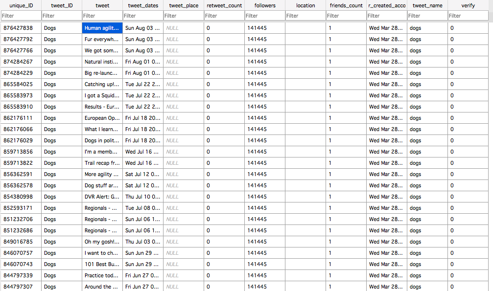

# Extracting Tweets using Twitter API (Tweepy)

* Last modified date: 2020.05.05

## 1. Overview


The purpose of this script is to extract tweets using the official Twitter API in a very simple way using python. It takes in twitter handles (unique usernames) and stores tweets of corresponding twitter handles into a database. Note that a user needs to create unique API key and access token to use this script. To request, visit [https://developer.twitter.com/en/docs/basics/authentication/oauth-1-0a/obtaining-user-access-tokens](https://developer.twitter.com/en/docs/basics/authentication/oauth-1-0a/obtaining-user-access-tokens). Also note that twitter API has rate limit [https://developer.twitter.com/en/docs/basics/rate-limiting](https://developer.twitter.com/en/docs/basics/rate-limiting).


## 2. Description/Details

### A. Authentication


To use, enter your credentials for following part.


```python
import tweepy

consumer_key=""
consumer_secret=""
access_token=""
access_token_secret=""
```


and set up authentication


```python
auth = tweepy.OAuthHandler(consumer_key, consumer_secret)
auth.set_access_token(access_token, access_token_secret)
api = tweepy.API(auth,wait_on_rate_limit=True,wait_on_rate_limit_notify=True)
```


### B. Creating the database


Create a database with a table named as **tweet** using the following code. In addition to four features, one can add additional features such as dates, place, location, the number of retweets, and the number of followers. The purpose of this script is to simply extract tweets, so I create a table as following. 


```python
import sqlite3

conn = sqlite3.connect('tweet.db')
c = conn.cursor()
c.execute("""CREATE TABLE tweet (
 	unique_ID integer,
 	tweet_ID text,
 	tweet text,
 	user_created_account date)
 	""")
```


### C. Extended Tweets


Since 2017, the character limit was expanded from 140 to 280 characters. Compatibility mode truncates tweets to 140 characters while extended mode returns entire texts of tweets. 


```python
a = api.get_status(unique_tweet_id, tweet_mode='extended')
text = a.full_text
```


### D. Additional features

In addition to tweeter id, name, and tweets that this script collects, users can add informations they would like to retrieve. See [http://docs.tweepy.org/en/latest/api.html?highlight=screen_name#tweepy-api-twitter-api-wrapper](http://docs.tweepy.org/en/latest/api.html?highlight=screen_name#tweepy-api-twitter-api-wrapper). Examples include the number of friends or date of a tweet posted.


```python
dates = (status._json['created_at'])
friends_count = (status._json['user']['friends_count'])
```


## 3. Results (Example)


Below is the snapshot of the results of tweets posed by ***@dog***. 

<p align="center">
</img><br/></p>